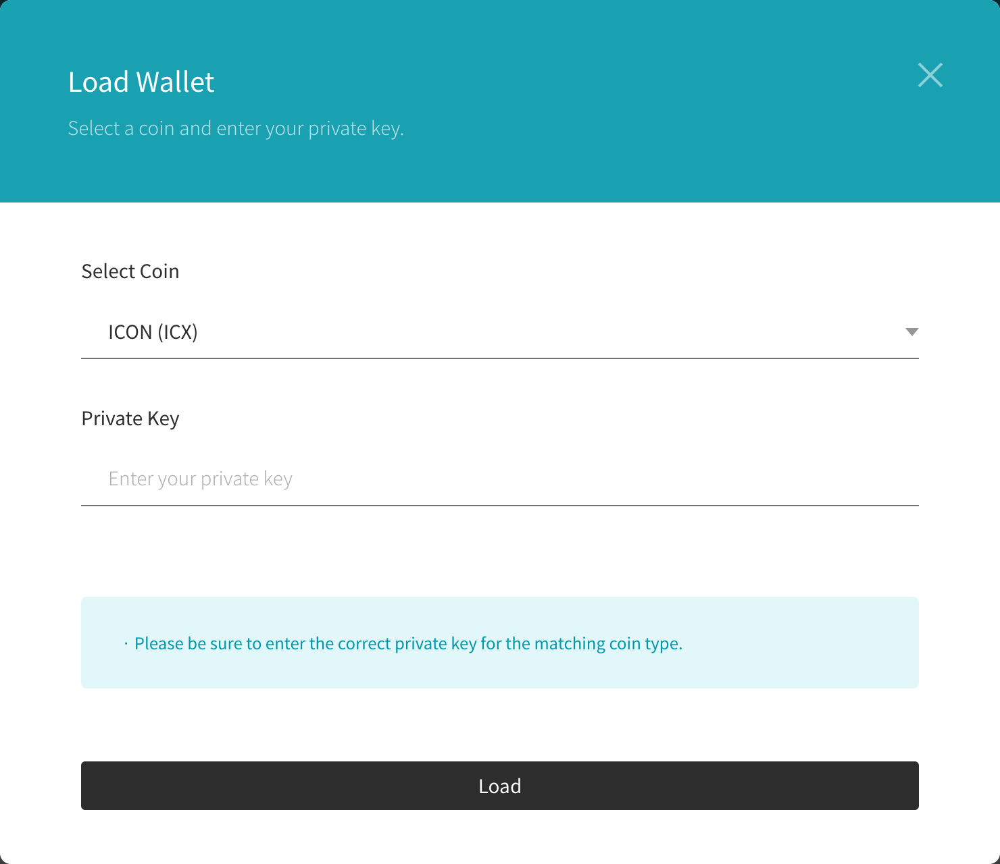

# HAVAH developer's guide

HAVAH is a blockchain engine based on [ICON](https://www.icon.foundation/). Basic operations such as smart contract creation and distribution, transaction request, and json-RPC interworking are the same as those of ICON.

This document contains the guide for testnet access information and smart contract creation.
 

## Smart contract

HAVAH writes smart contracts in the same way as ICON Java SCORE.

Please check the HAVAH Smart Contract sample document first.

- [HAVAH Smart Contract sample](https://github.com/havah-project/smart-contract-examples)


Refer to the document below for the Smart Contract API and utility library (scorex) used when writing smart contracts.

- [Smart Contract API Document](https://www.javadoc.io/doc/foundation.icon/javaee-api/latest/index.html)

- [scorex](https://github.com/icon-project/javaee-scorex)
 
build.gradle
```groovy
dependencies {
    implementation 'foundation.icon:javaee-scorex:0.5.3'
}

optimizedJar {
    from {
        configurations.runtimeClasspath.collect { it.isDirectory() ? it : zipTree(it) }
    }
}
```

Only allowed Java methods can be used when writing smart contracts. A list of allow methods can be found at the link below.

- [Smart Contract allowed methods](https://github.com/icon-project/devportal/blob/master/java-score-1/allowed-methods)

### ICON JAVA SCORE Toutorials

Also, you can refer to the ICON JAVA SCORE tutorials.

- [Java Tutorial Part 1: Setting Development Environment and Writing Smart Contract](https://icon.community/tutorials/java-tutorial-part-1-setting-development-environment-and-writing-smart-contract)

- [Java Tutorial Part 2: Deploying the Smart Contract and Interacting with the Smart Contract Onchain](https://icon.community/tutorials/java-tutorial-part-2-deploying-the-smart-contract-and-interacting-with-the-smart-contract-onchain)

- [Java Tutorial Part 3: Unit Testing](https://icon.community/tutorials/java-tutorial-part-3-unit-testing)

## HAVAH SCAN

HAVAH Scan is block explorer that can check all transactions and blocks, address and token information that occur in the HAVAH blockchain.

### Smart Contract Name and Symbol

If you implement name() in a smart contract, the name of that smart contract will be displayed in the code tab of HAVAH Scan. The name is displayed up to 256 characters.

```java
@External(readonly=true)
public String name() {
	return "KIKI Trip";
}
```


For FT and NFT contracts, a token symbol is displayed after the name.


### Smart Contract API name

It is recommended that the length of the smart contract API name be less than 30 characters. In HAVAH Scan, API names are displayed up to 30 characters.

### Handling contract errors

When revert is triggered by calling [Context.revert(int,String)](https://www.javadoc.io/doc/foundation.icon/javaee-api/latest/score/Context.html#revert(int,java.lang.String)), an error code and error message can be passed. The error code is displayed in the Status when checking the transaction in HAVAH Scan.


- Reverted(0) : The number in () is the error code passed as the first parameter when calling Context.revert(int,String).
- uint(0x20) : This is the error code delivered by the engine when revert occurs, and the default value is 32 (0x20). When calling revert(), if an error code specified by the user is passed, the value of 32 + the user's error code is passed.

## HAVAH SDK

Currently, there is no dedicated SDK for HAVAH. Integration is possible using the ICON SDK.

- [Java SDK](https://docs.icon.community/icon-stack/client-apis/java-sdk)

## Altair (BTP testnet)

Altair is the name of the HAVAH BTP testnet. To test BTP, you must connect to Altair. We do not yet support BTP on Vega or Mainnet.

See BTP Session for more information.

## Vega (testnet)

Vega is the name of the HAVAH testnet. Access information is as follows.

- JSON-RPC API endpoint

	- [https://ctz.vega.havah.io/api/v3](https://ctz.vega.havah.io/api/v3)

- nid (network id)

	- 0x101

- Block Explorer (HAVAH Scan)

	- [https://scan.vega.havah.io](https://scan.vega.havah.io)

- Faucet

	- If you pass your wallet address, we will deposit 20HVH to that address.

## Mainnet

The access information of HAVAH mainnet is as follows.

- JSON-RPC API endpoint

	- [https://ctz.havah.io/api/v3](https://ctz.vega.havah.io/api/v3)

- nid (network id)

	- 0x100

- Block Explorer (HAVAH Scan)

	- [https://scan.havah.io](https://scan.havah.io)

## HAVAH CHAIN NODE

HAVAH blockchain nodes can be operated using Docker images.

- HAVAH chain node docker

	- [https://github.com/havah-project/havah-chain-node-docker](https://github.com/havah-project/havah-chain-node-docker)

### Keystore

A keystore file can be created using the goloop CLI. See link below.

- [https://github.com/havah-project/goloop-havah/blob/main/doc/goloop_cli.md#goloop-ks-gen](https://github.com/havah-project/goloop-havah/blob/main/doc/goloop_cli.md#goloop-ks-gen)

Or refer to Tips, 'How to create a keystore file with a private key'.

### Node types

Due to the delegated nature of the ICON network, there are currently two different types of nodes: API Endpoints and Validators. API Endpoints are also called Citizen nodes.

#### API Endpoints (=Citizen)

- Stores full blockchain state
- Read capabilities
- Provides data to users

#### Validators

- Stores full blockchain state
- Read / write capabilities
- Provides data to API Endpoints and other validators

 For more information on node types, please refer to the link below.
 
 - [API Endpoints](https://docs.icon.community/concepts/network/api-endpoints)
 - [Validator nodes](https://docs.icon.community/concepts/network/validator-nodes)

## BTP

For information on BTP (Blockchain Transmission Protocol), please refer to the link below.

- [Relay System for BTP 2.0](https://github.com/icon-project/btp2)

- [Java Contracts for BTP2](https://github.com/icon-project/btp2-java)

- [Solidity Contracts for BTP2](https://github.com/icon-project/btp2-solidity)


### BTP Test Network (Altair)

- Endpoint
	- https://ctz.altair.havah.io

- RPC URL
	- https://ctz.altair.havah.io/api/v3/icon_dex

- NID
	- 0x111

- CID
	- 0xcd633c

- BTP Scan
    - [https://scan.altair.havah.io](https://scan.altair.havah.io)

## Tips

- Building in a windows WSL + ubuntu environment, the run directory must be located in the Ubuntu filesystem, not below /mnt/c

- If the javaee/exec/build/native/ folder is empty after make in the project folder, you need to create a native file by proceeding make in javaee/

- How to create a keystore file with a private key:

	1. Install ICONex chrome web browser extenstion.

		- [ICONex - chrome web store](https://chrome.google.com/webstore/detail/iconex/flpiciilemghbmfalicajoolhkkenfel)

	2. Select ICONex - 'Access My Wallet' - 'Add Wallets'
	
	3. Select 'Load Wallet' in the Add Wallet dialog.
	
	
	4. Select 'Enter private key' in the Load Wallet dialog.
	
	
	5. Select 'ICON (ICX)' and enter the private key.
	
	
	6. Select the 'Backup wallet' menu of the wallet.
	
	
	7. Enter Wallet password.
	
	8. You can download the keystore file by selecting 'Download Keystore file(wallet backup file)'.
	

- When sending a transaction using the goloop CLI tool, you need to add the --estimate option to get an estimated step.

```shell
goloop rpc sendtx transfer \
    --uri http://localhost:9080/api/v3 \
    --key_store ./data/keystore_gov.json --key_password gochain \
    --nid 0x110 --step_limit 1000000 \
    --to hxb6b5791be0b5ef67063b3c10b840fb81514db2fd \
    --estimate \
    --value 20000000000000000000
```

- Transation fee is calculated as step price * number of steps. To get the estimated fee, multiply the stepprice by the estimated step found with the --estimate option. The step price can be obtained by calling getStepPrice of Chain Score (cx0000000000000000000000000000000000000000).

```shell
goloop rpc call --to cx0000000000000000000000000000000000000000 \
    --uri http://localhost:9080/api/v3 \
    --method getStepPrice
```

## Development reference site

Please refer to the ICON DEV PORTAL for more information.

- [ICON DEV PORTAL](https://docs.icon.community/)

- [ICON goloop](https://github.com/icon-project/goloop)
