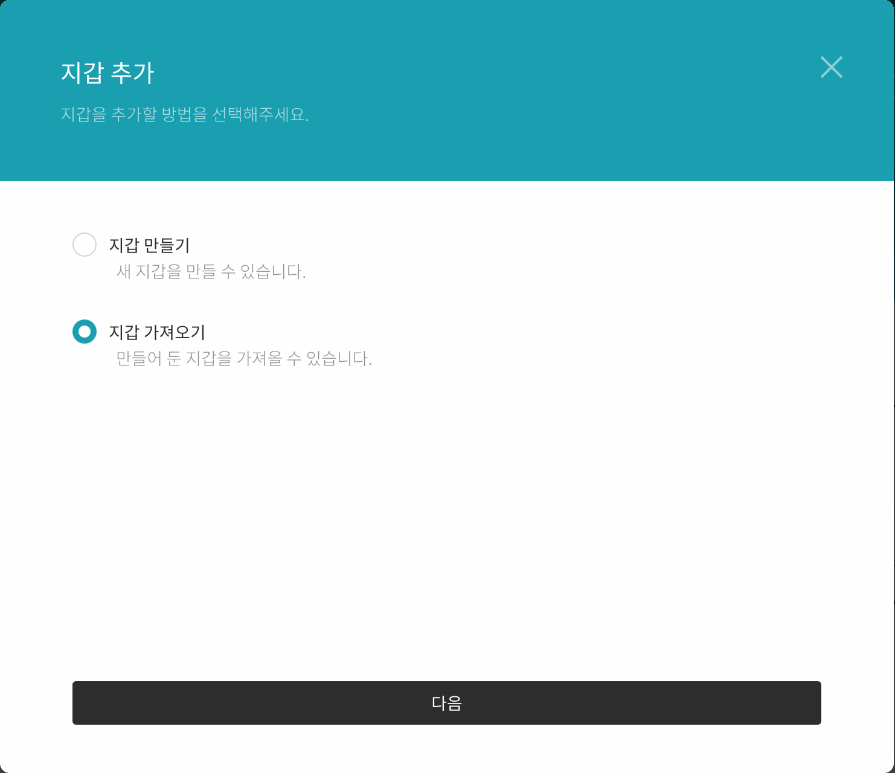
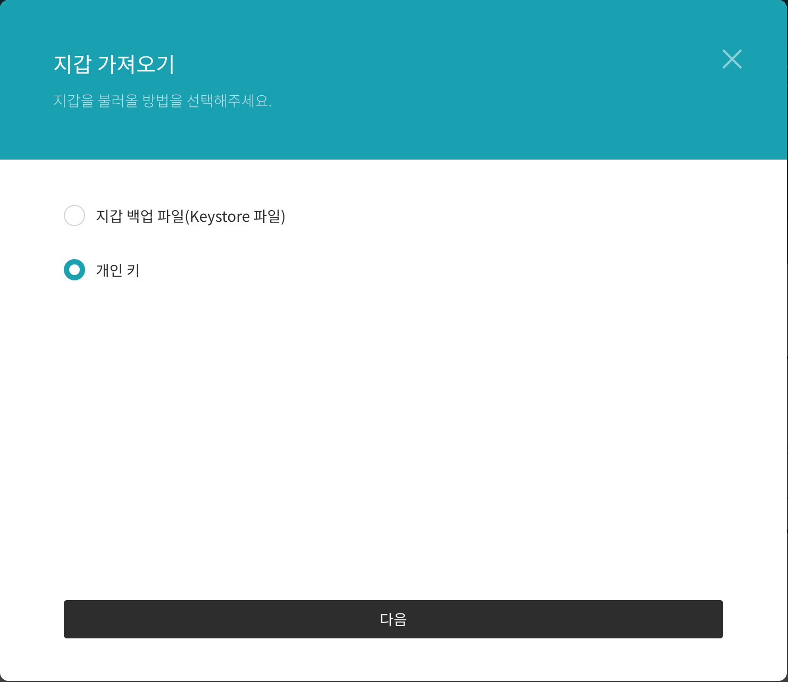
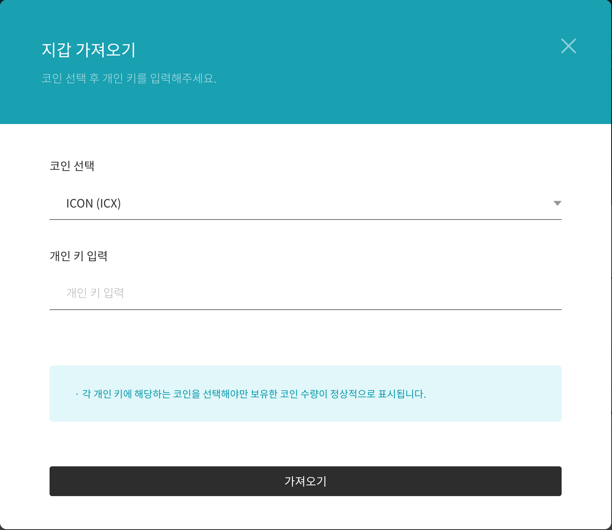
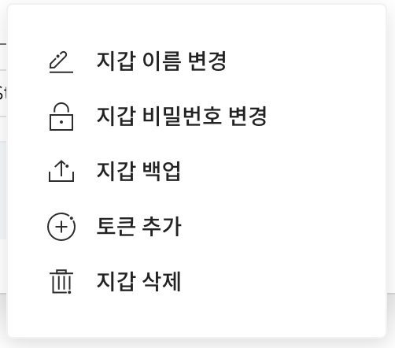
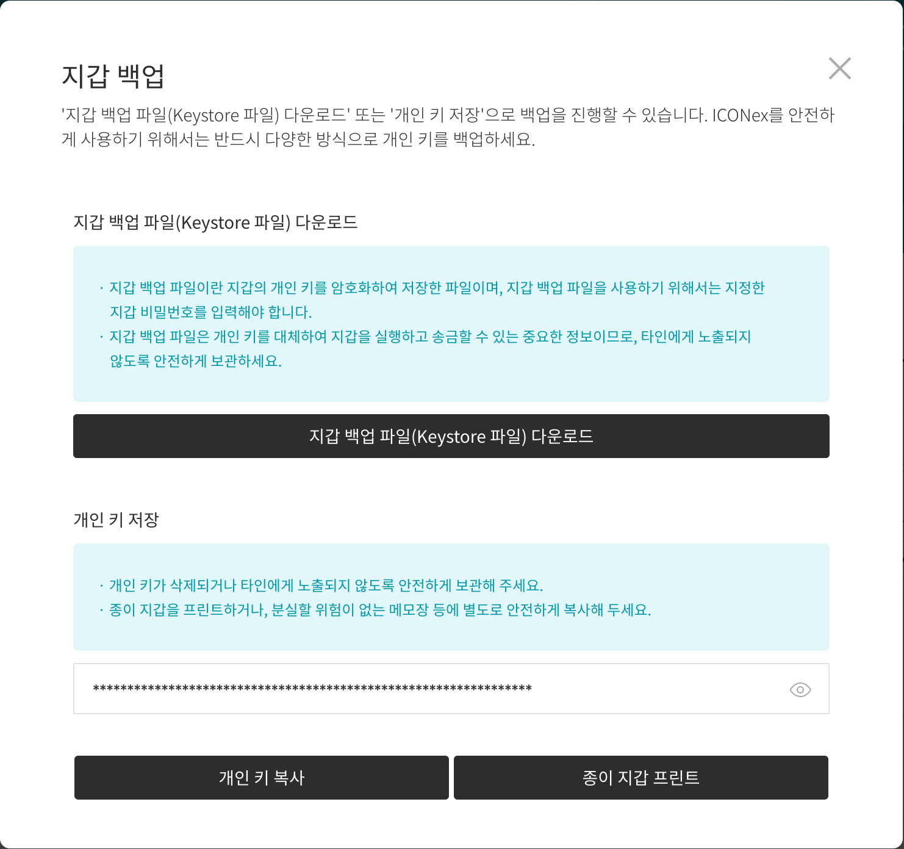

# Welcome

HAVAH 는 [ICON](https://www.icon.foundation/) 을 기반으로 한 블록체인 엔진입니다. 스마트 컨트랙트 작성 및 배포, Transaction 요청, json-RPC 연동 등 기본적인 동작은 ICON의 동작방식과 동일합니다.

이 문서는 테스트넷 접근 정보 및 스마트 컨트랙트 작성에 관해 안내하기 위해 만들어졌습니다.
 

## 스마트 컨트랙트

HAVAH는 아이콘 자바 스코어와 동일한 방식으로 스마트 컨트랙트를 작성합니다.

먼저 하바 스마트 컨트랙트 샘플 문서를 확인하시길 바랍니다.

- [HAVAH Smart Contract sample](https://github.com/havah-project/smart-contract-examples)


스마트 컨트랙트 작성시 사용되는 API 및 유틸리티 라이브러리(scorex) 는 아래 문서를 참고하세요.

- [Smart Contract API Document](https://www.javadoc.io/doc/foundation.icon/javaee-api/latest/index.html)

- [scorex](https://github.com/icon-project/javaee-scorex)
 
build.gradle
```groovy
dependencies {
    implementation 'foundation.icon:javaee-scorex:0.5.3'
}

optimizedJar {
    from {
        configurations.runtimeClasspath.collect { it.isDirectory() ? it : zipTree(it) }
    }
}
```

스마트 컨트랙트 작성시 허용된 자바 메소드만 사용할수 있습니다. 허용 메소드 목록은 아래 링크에서 확인하실 수 있습니다.

- [Smart Contract allowed methods](https://github.com/icon-project/devportal/blob/master/java-score-1/allowed-methods)
 

## HAVAH SDK

현재 HAVAH 전용 SDK는 준비되어 있지 않습니다. ICON SDK를 사용하여 연동이 가능합니다.

- [Java SDK](https://docs.icon.community/icon-stack/client-apis/java-sdk)


## Vega (testnet)

Vega 는 HAVAH 테스트넷의 이름입니다. 접근 정보는 아래와 같습니다.

- JSON-RPC API endpoint

	- [https://ctz.vega.havah.io/api/v3](https://ctz.vega.havah.io/api/v3)

- nid (network id)

	- 0x101

- Block Explorer (HAVAH scan)

	- [https://scan.vega.havah.io](https://scan.vega.havah.io)

- Fauset

	- 지갑주소를 전달하시면 해당 주소로 100HVH를 입금해드립니다.

## Mainnet

HAVAH 메인넷의 접근 정보는 아래와 같습니다.

- JSON-RPC API endpoint

	- [https://ctz.havah.io/api/v3](https://ctz.vega.havah.io/api/v3)

- nid (network id)

	- 0x100

- Block Explorer (HAVAH scan)

	- [https://scan.havah.io](https://scan.havah.io)


## Trouble shooting

- windows WSL + unbuntu 환경에서 빌드시 run 디렉토리는 /mnt/c 이하가 아닌 우분투 파일시스템에 위치해야 합니다.

- 프로젝트 폴더에서 make 빌드 후에 javaee/exec/build/native/  폴더가 비어 있을 경우, javaee/ 에서 make 빌드 진행하여 native 파일을 생성해야 합니다.

- 하바지갑에서 만든 계정의 개인 키로 키스토어 파일을 생성하려면 크롬 ICONex 지갑이 필요합니다.

	1. ICONex 크롬 웹브라우저 확장 프로그램을 설치합니다.

		- [ICONex - chrome 웹 스토어](https://chrome.google.com/webstore/detail/iconex/flpiciilemghbmfalicajoolhkkenfel)

	2. ICONex - '내 지갑 가기' - '지갑 추가' 메뉴를 선택합니다.
	
	3. 지갑 추가 다이얼로그에서 '지갑 가져오기'를 선택합니다.
	
	
	4. 지갑을 가져올 방법에서 '개인 키'를 선택합니다.
	
	
	5. 코인 선택은 'ICON (ICX)'을 선택하고 '개인 키 입력' 항목에 추가할 개인키를 입력합니다.
	
	
	6. 비밀키로 추가된 지갑의 '지갑 백업' 메뉴를 선택합니다.
	
	
	7. 지갑 비밀번호를 입력합니다.
	
	8. 지갑 백업 다이얼로그에서 '지갑 백업 파일(Keystore 파일) 다운로드'를 선택하면 키스토어 파일을 다운로드 받을 수 있습니다.
	


## 개발 참고 사이트

아이콘 데브 포탈을 참고하시면 더 많은 정보를 얻으실 수 있습니다.

- [ICON DEV PORTAL](https://docs.icon.community/)

- [ICON goloop](https://github.com/icon-project/goloop)