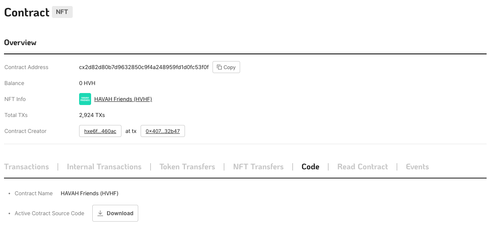
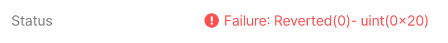

# HAVAH developer's guide

HAVAH 는 [ICON](https://www.icon.foundation/) 을 기반으로 한 블록체인 엔진입니다. 스마트 컨트랙트 작성 및 배포, Transaction 요청, json-RPC 연동 등 기본적인 동작은 ICON의 동작방식과 동일합니다.

이 문서는 테스트넷 접근 정보 및 스마트 컨트랙트 작성에 관해 안내하기 위해 만들어졌습니다.
 

## 스마트 컨트랙트

HAVAH는 아이콘 자바 스코어와 동일한 방식으로 스마트 컨트랙트를 작성합니다.

먼저 하바 스마트 컨트랙트 샘플 문서를 확인하시길 바랍니다.

- [HAVAH Smart Contract sample](https://github.com/havah-project/smart-contract-examples)


스마트 컨트랙트 작성시 사용되는 API 및 유틸리티 라이브러리(scorex) 는 아래 문서를 참고하세요.

- [Smart Contract API Document](https://www.javadoc.io/doc/foundation.icon/javaee-api/latest/index.html)

- [scorex](https://github.com/icon-project/javaee-scorex)
 
build.gradle
```groovy
dependencies {
    implementation 'foundation.icon:javaee-scorex:0.5.3'
}

optimizedJar {
    from {
        configurations.runtimeClasspath.collect { it.isDirectory() ? it : zipTree(it) }
    }
}
```

스마트 컨트랙트 작성시 허용된 자바 메소드만 사용할수 있습니다. 허용 메소드 목록은 아래 링크에서 확인하실 수 있습니다.

- [Smart Contract allowed methods](https://github.com/icon-project/devportal/blob/master/java-score-1/allowed-methods)

### ICON JAVA SCORE Toutorials

ICON 자바 스코어 튜토리얼을 참고하실수 있습니다.

- [Java Tutorial Part 1: Setting Development Environment and Writing Smart Contract](https://icon.community/tutorials/java-tutorial-part-1-setting-development-environment-and-writing-smart-contract)

- [Java Tutorial Part 2: Deploying the Smart Contract and Interacting with the Smart Contract Onchain](https://icon.community/tutorials/java-tutorial-part-2-deploying-the-smart-contract-and-interacting-with-the-smart-contract-onchain)

- [Java Tutorial Part 3: Unit Testing](https://icon.community/tutorials/java-tutorial-part-3-unit-testing)

## HAVAH SCAN

HAVAH Scan은 HAVAH 블록체인에서 발생하는 모든 트랜젝션 및 블록, 어드레스와 토큰 정보를 확인할 수 있는 블록 익스플로어를 말합니다. 

### Smart Contract Name and Symbol

스마트 컨트랙트에서 name() 함수를 구현하면 HAVAH Scan의 Code 탭에서 해당 스마트 컨트랙트의 이름이 표시됩니다. 이름은 최대 256자까지 표시됩니다.

```java
@External(readonly=true)
public String name() {
	return "KIKI Trip";
}
```


FT, NFT 컨트랙트의 경우 이름 뒤에 토큰 심볼이 표시됩니다.




### Smart Contract API name

스마트 컨트랙트 API 이름 길이는 30자 이내를 권장합니다. HAVAH Scan에서 API 이름은 30자까지 표시됩니다.  

### Handling contract errors

[Context.revert(int,String)](https://www.javadoc.io/doc/foundation.icon/javaee-api/latest/score/Context.html#revert(int,java.lang.String))를 호출하여 revert를 발생시킬때 에러 코드와 에러 메세지를 전달할수 있습니다. 에러 코드는 HAVAH Scan에서 트랙젝션 확인시 Status에 표시가 됩니다.



- Reverted(0) : ()안에 숫자는 Context.revert(int,String) 호출시 첫번째 파라미터로 전달한 에러코드입니다. 
- uint(0x20) : revert 발생시 엔진에서 전달해주는 에러코드로 기본값은 32(0x20)입니다. revert() 호출시 사용자가 지정한 에러코드가 전달되었다면 32 + 사용자 에러코드 값으로 전달됩니다.   

## HAVAH SDK

현재 HAVAH 전용 SDK는 준비되어 있지 않습니다. ICON SDK를 사용하여 연동이 가능합니다.

- [Java SDK](https://docs.icon.community/icon-stack/client-apis/java-sdk)

## Altair (BTP testnet)

Altair 는 HAVAH BTP 테스트넷의 이름입니다. BTP를 테스트 하려면, Altair에 접속해야 합니다. Vega나 메인넷에서는 BTP를 지원하지 않습니다.

자세한 정보는 [BTP 섹션](#btp)을 참고하세요.

## Vega (testnet)

Vega 는 HAVAH 테스트넷의 이름입니다. 접근 정보는 아래와 같습니다.

- JSON-RPC API endpoint

	- [https://ctz.vega.havah.io/api/v3](https://ctz.vega.havah.io/api/v3)

- nid (network id)

	- 0x101

- Block Explorer (HAVAH Scan)

	- [https://scan.vega.havah.io](https://scan.vega.havah.io)

- Faucet

	- [https://faucet.vega.havah.io](https://faucet.vega.havah.io)

## Mainnet

HAVAH 메인넷의 접근 정보는 아래와 같습니다.

- JSON-RPC API endpoint

	- [https://ctz.havah.io/api/v3](https://ctz.vega.havah.io/api/v3)

- nid (network id)

	- 0x100

- Block Explorer (HAVAH Scan)

	- [https://scan.havah.io](https://scan.havah.io)

## HAVAH CHAIN NODE

Docker 이미지를 이용하여 HAVAH 블록체인 노드를 운영할 수 있습니다.

- HAVAH chain node docker

	- [https://github.com/havah-project/havah-chain-node-docker](https://github.com/havah-project/havah-chain-node-docker)

### Keystore

키스토어 파일은 goloop CLI를 사용해 생성할 수 있습니다. 아래 링크를 참고하세요.

- [https://github.com/havah-project/goloop-havah/blob/main/doc/goloop_cli.md#goloop-ks-gen](https://github.com/havah-project/goloop-havah/blob/main/doc/goloop_cli.md#goloop-ks-gen)

혹은 Tips의 '하바지갑에서 생성한 개인 키로 키스토어를 생성하는 방법'을 참고하십시오.

### Node types

HAVAH 블록체인 네크워크에는 두 가지 유형의 노드가 있습니다. API Endpoints와 Validator 노드입니다. API Endpoints는 Citizen 노드라고도 불립니다.

#### API Endpoints (=Citizen)

- 전체 블록체인 상태 저장
- 블록체인 상태 읽기 기능
- 사용자에게 데이터 제공

#### Validators

- 전체 블록체인 상태 저장
- 블록체인 상태 읽기/쓰기 기능
- API Endpoints 및 다른 Validator에 데이터 제공

 노드 타입에 대해 좀 더 자세한 정보가 필요하시면 아래 링크를 참고하세요.
 
 - [API Endpoints](https://docs.icon.community/concepts/network/api-endpoints)
 - [Validator nodes](https://docs.icon.community/concepts/network/validator-nodes)

## BTP

BTP(Blockchain Transmission Protocol) 관련 정보는 아래 링크를 참고하세요.

- [Relay System for BTP 2.0](https://github.com/icon-project/btp2)

- [Java Contracts for BTP2](https://github.com/icon-project/btp2-java)

- [Solidity Contracts for BTP2](https://github.com/icon-project/btp2-solidity)


### BTP Test Network (Altair)

- RPC URL
	- https://ctz.altair.havah.io/api/v3/icon_dex

- NID
	- 0x111

- BTP Scan
	- [https://scan.altair.havah.io](https://scan.altair.havah.io)

- Faucet
    - [https://faucet.altair.havah.io](https://faucet.altair.havah.io)

## Tips

- windows WSL + unbuntu 환경에서 빌드시 run 디렉토리는 /mnt/c 이하가 아닌 우분투 파일시스템에 위치해야 합니다.

- 프로젝트 폴더에서 make 빌드 후에 javaee/exec/build/native/  폴더가 비어 있을 경우, javaee/ 에서 make 빌드 진행하여 native 파일을 생성해야 합니다.

- 개인 키로 키스토어 파일을 생성하는 방법:

    1. ICONex 크롬 웹브라우저 확장 프로그램을 설치합니다.

        - [ICONex - chrome 웹 스토어](https://chrome.google.com/webstore/detail/iconex/flpiciilemghbmfalicajoolhkkenfel)

    2. ICONex - '내 지갑 가기' - '지갑 추가' 메뉴를 선택합니다.
	
    3. 지갑 추가 다이얼로그에서 '지갑 가져오기'를 선택합니다.
	
	
    4. 지갑을 가져올 방법에서 '개인 키'를 선택합니다.
	
	
    5. 코인 선택은 'ICON (ICX)'을 선택하고 '개인 키 입력' 항목에 추가할 개인키를 입력합니다.
	
	
    6. 비밀키로 추가된 지갑의 '지갑 백업' 메뉴를 선택합니다.
	
	
    7. 지갑 비밀번호를 입력합니다.
	
    8. 지갑 백업 다이얼로그에서 '지갑 백업 파일(Keystore 파일) 다운로드'를 선택하면 키스토어 파일을 다운로드 받을 수 있습니다.
	
  
    9. 키스토어 파일의 BOM을 제거합니다.
	```shell
	sed -i '' '1s/^\xEF\xBB\xBF//' keystore.json
	```


- goloop CLI 툴을 사용하여 트랜젝션 전송시 예상 스텝을 확인하려면 --estimate 옵션을 붙여야 합니다.

```shell
goloop rpc sendtx transfer \
    --uri http://localhost:9080/api/v3 \
    --key_store ./data/keystore_gov.json --key_password gochain \
    --nid 0x110 --step_limit 1000000 \
    --to hxb6b5791be0b5ef67063b3c10b840fb81514db2fd \
    --estimate \
    --value 20000000000000000000
```

- 트랜젝션 수수료는 스텝 프라이스 * 스텝수로 계산됩니다. 예상 수수료를 구하려면 --estimate 옵션으로 알아낸 예상 스텝에 스텝프라이스를 곱하여 알 수 있습니다. 스텝 프라이스는 Chain Score(cx0000000000000000000000000000000000000000)의 getStepPrice 를 호출하여 알 수 있습니다.

```shell
goloop rpc call --to cx0000000000000000000000000000000000000000 \
    --uri http://localhost:9080/api/v3 \
    --method getStepPrice
```


## 개발 참고 사이트

아이콘 데브 포탈을 참고하시면 더 많은 정보를 얻으실 수 있습니다.

- [ICON DEV PORTAL](https://docs.icon.community/)

- [ICON goloop](https://github.com/icon-project/goloop)
